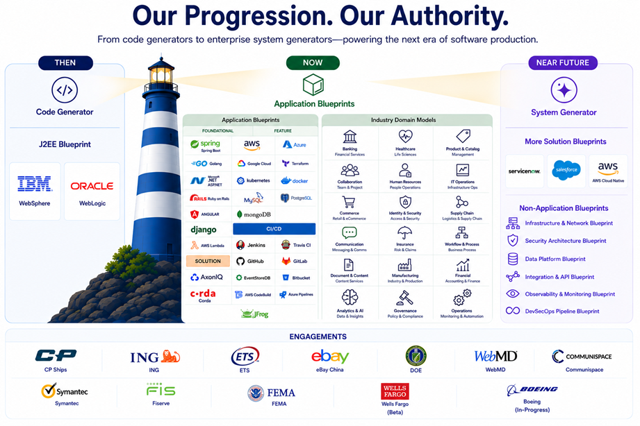
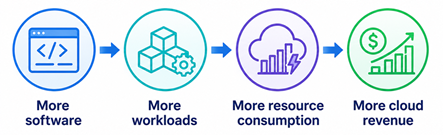
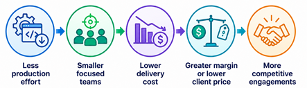
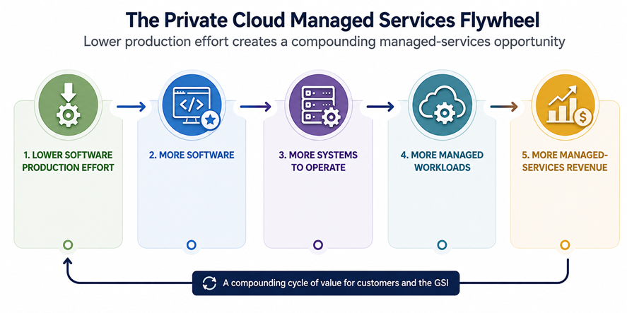

# The Harbormaster Thesis

## Software Is Still Produced One System at a Time

Every organization that creates software systems repeatedly performs much of the same work:

architecture, design, implementation, integration, testing, infrastructure, deployment and operational configuration.

Much of the knowledge required to perform that work already exists inside the organization — in its people, its architectures, its standards, its previous systems and its technology choices.

The fundamental question is:

> **What if that accumulated knowledge could become reusable, executable production capability?**

Harbormaster is built around that premise.

It captures software expertise in blueprints and domain models, combines that knowledge with configuration and policies, and compiles it into complete systems.

The objective is not simply to generate code.

> **The objective is to make software-system production progressively less dependent on recreating what is already known.**

---



---

# One Technology. Different Economic Outcomes.

The same transformation can create different forms of value depending on the organization applying it.

### Select a perspective

| Target                                     | Catalyst /  Outcome   | 
|--------------------------------------------|-------------------------------------------------------------------------------| 
| ☁️ **Public Cloud Provider**               | **Turn software-production efficiency into more cloud resource consumption.** 
| 🏢 **GSI/Software Delivery Org**           | **Turn software-production efficiency into greater delivery economics.**      |                                                                                                                      
| ☁️🏢 **GSI w/ Private/Hybrid Cloud**       | **GSI Value while serving as a catalyst to more managed-services demand:**   |

---

## ☁️ Cloud Provider

### From Cloud Infrastructure Provider to Software-Production Intelligence Provider

A cloud provider can use Harbormaster to transform its accumulated technology, architectural and industry expertise into an expanding software-production capability.

As software becomes less expensive to produce:




The opportunity is not simply to run more software.

> **It is to make more software economically viable to create, modernize and operate on the cloud.**

[Explore the Cloud Provider Thesis →](./cloud-provider/README.md)

---

## 🏢 GSI / Software Delivery Organization

### From Engineering Services Company to Software-Production Intelligence Company

A GSI can use Harbormaster to transform accumulated engineering knowledge into reusable, executable production capability.

As more of the production process becomes encoded in blueprints:



**Less production effort → smaller focused teams → lower delivery cost → greater margin or lower client price → more competitive engagements**

The opportunity is not simply to deliver existing projects more efficiently.

> **It is to fundamentally change the economics of software delivery.**

[Explore the GSI Thesis →](./gsi/README.md)

---

## ☁️🏢 GSI / Private Cloud Managed Services Organization

### From Managed Infrastructure Provider to Software-Production Intelligence Provider

A GSI with private-cloud infrastructure can use Harbormaster to transform accumulated engineering, architectural and industry expertise into an expanding software-production capability.

As more software becomes economically viable to create and modernize:



The opportunity is not simply to host more software.

> **It is to make more software economically viable to create, modernize and operate as managed workloads.**

More software production creates more applications to migrate, deploy, operate, secure, monitor, maintain and evolve—expanding the managed-services opportunity without requiring the GSI to proportionally expand its delivery workforce.

Explore Hybrid Thesis For:  

[IBM](./hybrid/ibm/README.md)  
[NTT Data](./hybrid/nttdata/README.md)  
[Kyndryl](./hybrid/kyndryl/README.md)  
[DXC](./hybrid/dxc/README.md)  

---

# The Common Transformation

Regardless of who applies it, the underlying transformation is the same:

```text
                   HARBORMASTER
                         │
          ┌──────────────┼──────────────┐
          ▼              ▼              ▼
       ENTERPRISE       GSI          PLATFORM
       SOFTWARE       DELIVERY       SOFTWARE
          │              │              │
          │              │              ▼
          │              │      Developer adoption
          │              │              │
          ▼              ▼              ▼
       Systems       Services      Technology
       created       delivered      consumed
          │              │              │
          └──────────────┼──────────────┘
                         ▼
                   MORE SOFTWARE
                         │
                         ▼
                  MORE WORKLOADS
                         │
                         ▼
                MORE PLATFORM VALUE