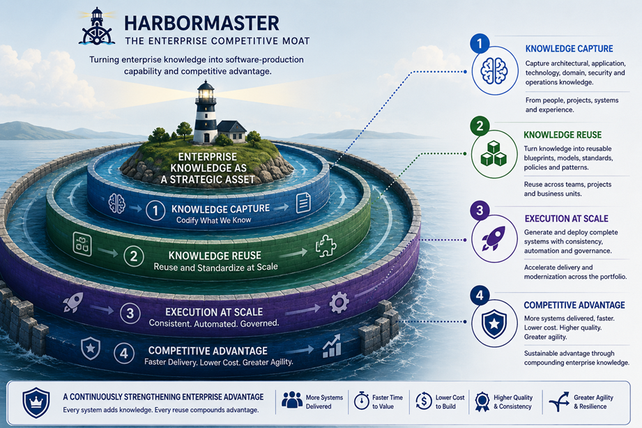

[<<< return](../README.md)

#### From Enterprise Software Organization to Software-Production Intelligence Company

> A set of hypotheses about how a large enterprise could use Harbormaster to transform accumulated application, architecture, infrastructure, technology and domain knowledge into reusable, executable software-production capability—enabling more consistent software production, faster modernization, greater engineering capacity, and an increasingly intelligent software-production environment. Each hypothesis is intended to be examined against evidence.

## The Four-Layer Moat

1. **Layer 1 — Software-Production Platform** — *The Engine That Turns Knowledge Into Executable Systems*
2. **Layer 2 — Proprietary Enterprise Production IP** — *What We Know. What We Can Reuse.*
3. **Layer 3 — Compounding Portfolio Advantage** — *Every System Makes the Enterprise Stronger*
4. **Layer 4 — AI Production Intelligence** — *The Moat That Learns, Improves and Accelerates*

---

## Evidence Matrix

| Hypothesis | Layer | Status | Evidence / description |
|---|---:|---|---|
| [H1-01 — Software production can be systematized](./layer-1/h1-01.md) | 1 | Demonstrated | Blueprint, domain model, generated system |
| [H1-02 — Generation can produce production-ready systems](./layer-1/h1-02.md) | 1 | Demonstrated | System-as-Code, Git repository, Docker image |
| [H1-03 — Production can be separated from individual developers](./layer-1/h1-03.md) | 1 | Partial | Blueprints, models and production rules |
| [H1-04 — Lower production effort can increase engineering capacity](./layer-1/h1-04.md) | 1 | Future | Production-effort measurements and comparable project economics |
| [H2-01 — Enterprise application and architecture expertise can become executable IP](./layer-2/h2-01.md) | 2 | Demonstrated | Blueprint YAML, domain models |
| [H2-02 — Technology expertise can become reusable technology blueprints](./layer-2/h2-02.md) | 2 | Demonstrated | Spring Boot, Axon 4, Corda blueprints |
| [H2-03 — Enterprise standards and policies can be encoded](./layer-2/h2-03.md) | 2 | Partial | Configuration, deployment and system-generation rules |
| [H2-04 — Industry and business-domain knowledge can become reusable production IP](./layer-2/h2-04.md) | 2 | Demonstrated | Industry domain models, generated systems |
| [H3-01 — Every system can improve the enterprise production system](./layer-3/h3-01.md) | 3 | Future | System-to-blueprint refinement examples |
| [H3-02 — Lower production effort can increase the number of economically viable systems](./layer-3/h3-02.md) | 3 | Future | Comparable project economics |
| [H3-03 — Reusable production knowledge can accelerate application modernization](./layer-3/h3-03.md) | 3 | Future | Modernization effort and portfolio measurements |
| [H3-04 — An enterprise can create a production knowledge factory](./layer-3/h3-04.md) | 3 | Future | Blueprint lifecycle, certification and reuse |
| [H3-05 — Enterprise-wide reuse can compound software-production advantage](./layer-3/h3-05.md) | 3 | Future | Cross-system reuse and production-effort measurements |
| [H4-01 — Structured production knowledge makes AI more valuable](./layer-4/h4-01.md) | 4 | Partial | Blueprints, models, generated systems |
| [H4-02 — AI can progress from assisting to authoring](./layer-4/h4-02.md) | 4 | Future | AI progression illustration, blueprint examples |
| [H4-03 — Enterprise production knowledge can become AI-ready](./layer-4/h4-03.md) | 4 | Future | Accumulated blueprint, model and production repository |
| [H4-04 — AI can increasingly connect enterprise knowledge with software production](./layer-4/h4-04.md) | 4 | Future | Production intelligence and automation |
| [H4-05 — Accumulated knowledge can continuously improve software production](./layer-4/h4-05.md) | 4 | Future | Production, modernization and engineering-outcome measurements |

---

## Hypothesis Index

Each hypothesis uses the same outline: **Summary, Implementation, Value — Today, Value — Tomorrow, Evidence, and Vision.**

### Layer 1 · Software-Production Platform

- [H1-01 — Software Production Can Be Systematized](./layer-1/h1-01.md) — Layer 1 · Platform
- [H1-02 — Generation Can Produce Production-Ready Systems](./layer-1/h1-02.md) — Layer 1 · Platform
- [H1-03 — Production Can Be Separated From Individual Developers](./layer-1/h1-03.md) — Layer 1 · Platform
- [H1-04 — Lower Production Effort Can Increase Engineering Capacity](./layer-1/h1-04.md) — Layer 1 · Platform

### Layer 2 · Proprietary Enterprise Production IP

- [H2-01 — Enterprise Application and Architecture Expertise Can Become Executable IP](./layer-2/h2-01.md) — Layer 2 · Production IP
- [H2-02 — Technology Expertise Can Become Reusable Technology Blueprints](./layer-2/h2-02.md) — Layer 2 · Production IP
- [H2-03 — Enterprise Standards and Policies Can Be Encoded](./layer-2/h2-03.md) — Layer 2 · Production IP
- [H2-04 — Industry and Business-Domain Knowledge Can Become Reusable Production IP](./layer-2/h2-04.md) — Layer 2 · Production IP

### Layer 3 · Compounding Portfolio Advantage

- [H3-01 — Every System Can Improve the Enterprise Production System](./layer-3/h3-01.md) — Layer 3 · Compounding Advantage
- [H3-02 — Lower Production Effort Can Increase the Number of Economically Viable Systems](./layer-3/h3-02.md) — Layer 3 · Compounding Advantage
- [H3-03 — Reusable Production Knowledge Can Accelerate Application Modernization](./layer-3/h3-03.md) — Layer 3 · Compounding Advantage
- [H3-04 — An Enterprise Can Create a Production Knowledge Factory](./layer-3/h3-04.md) — Layer 3 · Compounding Advantage
- [H3-05 — Enterprise-Wide Reuse Can Compound Software-Production Advantage](./layer-3/h3-05.md) — Layer 3 · Compounding Advantage

### Layer 4 · AI Production Intelligence

- [H4-01 — Structured Production Knowledge Makes AI More Valuable](./layer-4/h4-01.md) — Layer 4 · AI Intelligence
- [H4-02 — AI Can Progress From Assisting To Authoring](./layer-4/h4-02.md) — Layer 4 · AI Intelligence
- [H4-03 — Enterprise Production Knowledge Can Become AI-Ready](./layer-4/h4-03.md) — Layer 4 · AI Intelligence
- [H4-04 — AI Can Increasingly Connect Enterprise Knowledge With Software Production](./layer-4/h4-04.md) — Layer 4 · AI Intelligence
- [H4-05 — Accumulated Knowledge Can Continuously Improve Software Production](./layer-4/h4-05.md) — Layer 4 · AI Intelligence

## Closing

> *A continuously expanding body of executable enterprise software-production knowledge, accumulated from applications, architects, developers, projects and business domains, captured in reusable blueprints and domain models, and increasingly used by AI to create, modernize and improve the enterprise's software systems.*

[<<< return](../README.md)