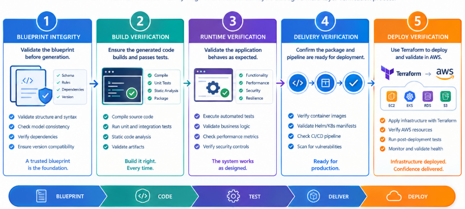

# System Certification

## Introduction
Each system automatically undergoes a 5-step verification process.  

Once complete, the system is assigned a certification level (Platinum, Gold, Silver or Bronze) based on its overall score.