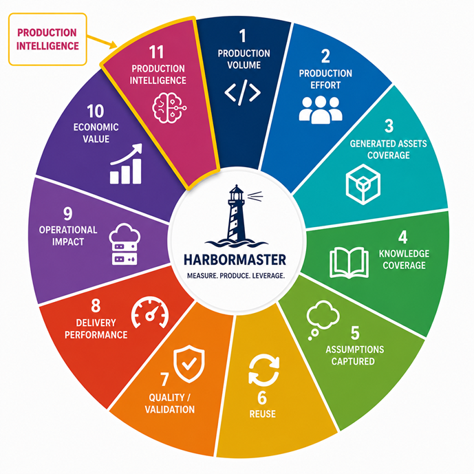

# Harbormaster Measurement Framework

Harbormaster's measurement framework establishes a hierarchy of evidence for understanding the transformation from human knowledge and assumptions into production-ready systems and, ultimately, operational and economic outcomes.

The objective is not simply to measure how much code Harbormaster generates. It is to measure how much software-production knowledge has been captured, how much production effort it replaces, how much of a system it can produce, how reliably it produces it, how often that knowledge is reused, and what operational and economic outcomes result.

## Measurement Categories



| Category | What It Measures | Importance |
|---|---|---|
| **1. Production Volume** | What Harbormaster actually produces | Establishes the magnitude of production output |
| **2. Production Effort** | Human effort required to produce the system | Demonstrates productivity improvement and production leverage |
| **3. Generated Asset Coverage** | Code, infrastructure, CI/CD, configuration, tests and other production artifacts generated | Shows how much of the system is produced automatically |
| **4. Knowledge Coverage** | How much system knowledge is represented by blueprints and models | Measures the expanding production capability |
| **5. Assumptions Captured** | Decisions and constraints represented as explicit production knowledge | Measures knowledge that would otherwise depend on individual experts |
| **6. Reuse** | How often existing production knowledge is reused | Demonstrates compounding production capability |
| **7. Quality and Validation** | Whether generated systems compile, test, deploy and operate successfully | Establishes credibility of generated production |
| **8. Delivery Performance** | Time, effort and team size required to deliver systems | Converts production capability into measurable delivery outcomes |
| **9. Operational Impact** | Systems, deployments, workloads and infrastructure resulting from production | Connects software production to cloud and managed-operations economics |
| **10. Economic Value** | Cost, capacity, margin, revenue and consumption effects | Converts technical capability into business value |
| **11. Production Intelligence** | The structured production knowledge available for increasingly intelligent and AI-assisted production | Measures the long-term strategic moat |

---

# 1. Production Volume

## What It Measures

Production volume measures the tangible software and technology artifacts produced by Harbormaster.

Possible measurements include:

- Lines of code
- Number of classes
- Number of methods
- APIs
- Database tables
- Entities
- Relationships
- Tests
- Configuration files
- Docker artifacts
- Kubernetes manifests
- Terraform resources
- CI/CD workflows
- Infrastructure components
- Generated repositories
- Deployable services
- Complete systems

A production record might capture:

```text
47,000 lines of Java
183 classes
62 database artifacts
41 APIs
96 tests
14 infrastructure artifacts
1 complete CI/CD pipeline
1 deployable system
```

## Why It Matters

Lines of code are not the ultimate measure of value, but they provide a physical measurement of production output.

Production volume establishes:

> **How much software and technology did Harbormaster actually produce?**

When combined with production effort, volume becomes a basis for measuring production leverage.

---

# 2. Production Effort

## What It Measures

Production effort measures the human resources required to produce a system.

Possible measurements include:

- Developer hours
- Architect hours
- SME hours
- DevOps hours
- QA hours
- Infrastructure engineering hours
- Total person-hours
- Number of people involved
- Calendar time
- Number of sprints

## Why It Matters

Production volume alone does not demonstrate productivity.

The meaningful measurement is the relationship between output and effort.

For example:

```text
Harbormaster:
47,000 lines / 32 human hours

Traditional production:
47,000 lines / 1,200 human hours
```

This establishes **production leverage**.

The objective is to measure how much production output can be created for a defined amount of human effort.

---

# 3. Generated Asset Coverage

## What It Measures

A modern system contains much more than application code.

Harbormaster can measure the percentage of each production artifact generated automatically.

Example:

```text
Application code             92%
Database                    100%
REST APIs                   100%
Tests                        85%
Docker                      100%
CI/CD                       100%
Infrastructure               95%
Configuration                90%
Documentation                70%
Security configuration       80%
```

## Why It Matters

This creates a stronger measurement than lines of code:

> **What percentage of the production artifact did Harbormaster actually create?**

This can become a key **Production Coverage** metric.

Production Coverage can be measured across application, infrastructure, deployment, testing, security and operational artifacts.

---

# 4. Knowledge Coverage

## What It Measures

Knowledge coverage measures how much of the knowledge required to produce a system is represented in reusable, executable form.

Harbormaster can represent knowledge through:

- Industry domain models
- Technology blueprints
- Solution blueprints
- Infrastructure blueprints
- Production rules
- Configuration
- Policies
- Deployment patterns

For example:

```text
Industry Model
      ↓
Solution Knowledge
      ↓
Technology Blueprint
      ↓
Infrastructure Blueprint
      ↓
Deployment Configuration
      ↓
Generated System
```

## Blueprint Coverage

A useful measurement is the percentage of required production knowledge already represented in reusable blueprints.

Example:

```text
Year 1   50%
Year 2   62%
Year 3   73%
Year 4   82%
Year 5   90%
```

## Why It Matters

Knowledge coverage measures the expansion of what Harbormaster knows how to produce.

It shifts measurement from:

> **What was produced?**

to:

> **What can be produced?**

---

# 5. Assumptions Captured

## What It Measures

Software projects contain large numbers of architectural, technical and implementation decisions.

Examples include:

- Authentication approach
- Database technology
- Entity relationships
- API conventions
- Error handling
- Logging
- Deployment model
- Security model
- CI/CD process
- Container configuration
- Infrastructure topology
- Retry policies
- Transaction boundaries
- Architectural patterns

Harbormaster can represent these decisions explicitly through models, blueprints, configurations and policies.

## Possible Measurement

A project could measure:

```text
Traditional project
~1,200 implicit production decisions

Harbormaster system
860 encoded decisions
340 remaining human decisions
```

Over time:

```text
Human decisions required

1,200 → 800 → 500 → 250 → 100
```

## Why It Matters

This measures the transition from knowledge existing primarily in people's heads to knowledge existing as explicit, reusable production capability.

The fundamental measurement becomes:

> **How much of software production has become explicit, structured and executable knowledge?**

---

# 6. Reuse

## What It Measures

Reuse measures how frequently previously created production knowledge is applied to subsequent systems.

Possible measurements include:

- Blueprint reuse count
- Domain-model reuse
- Component reuse
- Configuration reuse
- Production-rule reuse
- Cross-customer reuse
- Cross-industry reuse
- Cross-project reuse

Example:

```text
Blueprint A
Used in 1 system

Blueprint B
Used in 7 systems

Blueprint C
Used in 23 systems
```

## Reuse Ratio

A useful aggregate measure is the percentage of production that comes from previously created knowledge.

Example:

```text
New production knowledge       30%
Previously created knowledge   70%
```

## Why It Matters

Reuse is a primary indicator of compounding capability.

The objective is for the amount of production derived from reusable knowledge to continually increase.

---

# 7. Quality and Validation

## What It Measures

Quality and validation establish whether generated production artifacts actually work.

Possible measurements include:

- Compile success
- Unit test success
- Integration test success
- Runtime validation
- Container validation
- Infrastructure validation
- Deployment success
- Security validation
- API validation
- Database validation
- CI/CD validation
- First-generation production success

Example:

```text
Generated systems              100
Compile successfully            98
Pass automated tests            94
Deploy successfully              92
Runtime validated                90
```

## Why It Matters

Generation alone is insufficient.

Validation establishes whether Harbormaster's production capability produces credible, deployable and operational systems.

The objective is to establish:

> **How reliably can Harbormaster produce a working system?**

---

# 8. Delivery Performance

## What It Measures

Delivery performance translates Harbormaster's production capability into project-level outcomes.

### Time

Measure:

```text
Requirements → system
Architecture → system
Model → system
System → deployment
```

### Effort

Measure:

```text
Architect hours
Developer hours
DevOps hours
QA hours
```

### Team

Measure:

```text
Architects
Developers
DevOps
QA
```

## Why It Matters

The central delivery measurement is:

> **Time and effort required to produce a system of defined scope.**

This provides the bridge between technical production measurements and business economics.

---

# 9. Operational Impact

## What It Measures

Once Harbormaster produces more systems, those systems create operational workloads.

The production-to-operations chain can be measured as:

```text
Systems created
       ↓
Applications deployed
       ↓
Workloads created
       ↓
Infrastructure consumed
       ↓
Operations required
```

Possible measurements include:

- Number of deployed systems
- Containers
- VMs
- Kubernetes workloads
- CPUs
- Memory
- Storage
- Network traffic
- Databases
- Cloud resources
- Managed workloads
- Tickets
- Monitoring events
- Operational hours

## Why It Matters

This connects software production to the economics of:

- Cloud providers
- GSI delivery organizations
- Hybrid cloud providers
- Managed service providers

The measurement establishes the relationship between:

> **More efficient software production**

and:

> **More deployed and managed technology.**

---

# 10. Economic Value

## What It Measures

Economic value converts the preceding technical and operational measurements into business outcomes.

### Enterprise

```text
Cost to produce a system ↓
Time to production ↓
Production capacity ↑
```

### GSI

```text
Delivery capacity ↑
Cost per engagement ↓
Margin opportunity ↑
```

### Cloud Provider

```text
Systems deployed ↑
Workloads ↑
Platform consumption ↑
```

### Managed Service Provider

```text
Managed workloads ↑
Recurring operational demand ↑
Operational opportunity ↑
```

### Hybrid GSI

```text
Production
    ↓
Deployment
    ↓
Managed operation
```

## Why It Matters

Economic measurement establishes the business value created by Harbormaster.

It allows technical measurements to be connected to:

- Cost reduction
- Capacity expansion
- Margin improvement
- Revenue opportunity
- Cloud consumption
- Infrastructure consumption
- Managed-services opportunity

---

# 11. Production Intelligence

## What It Measures

Production intelligence measures the structured body of production knowledge available to Harbormaster and the degree to which that knowledge can support increasingly intelligent production.

Possible measurements include:

```text
Industry domain models
240+

Technology blueprints
X

Solution blueprints
X

Infrastructure patterns
X

Deployment patterns
X

Production rules
X

Validated systems
X

Production decisions
X

Historical outcomes
X
```

The more important measurement is the relationship between these artifacts.

```text
Industry Model
      ↓
Solution Knowledge
      ↓
Technology Blueprint
      ↓
Infrastructure Blueprint
      ↓
Deployment Configuration
      ↓
Validated System
      ↓
Operational Outcome
      ↓
Improved Production Knowledge
```

## Why It Matters

Harbormaster is not simply accumulating files or generated code.

It is accumulating relationships between:

- Production decisions
- Production knowledge
- Generated systems
- Validation results
- Operational outcomes

This creates the foundation for increasingly intelligent software production.

---

# The Measurement Stack

The categories form a hierarchy of evidence:

```text
                         ECONOMIC VALUE
                              ▲
                              │
                     Operational Impact
                              ▲
                              │
                     Delivery Performance
                              ▲
                              │
                    Quality / Validation
                              ▲
                              │
                           Reuse
                              ▲
                              │
                    Knowledge Coverage
                              ▲
                              │
                    Assumptions Captured
                              ▲
                              │
                    Generated Production
                              ▲
                              │
                       Production Effort
                              ▲
                              │
                       Production Volume
```

Each level provides evidence for the level above it.

Production volume establishes output.

Production effort establishes the resources required to create that output.

Generated asset coverage establishes how much of the system is produced automatically.

Knowledge coverage and assumptions captured establish how much production knowledge has become explicit and reusable.

Reuse establishes whether that knowledge compounds across systems.

Quality and validation establish whether generated systems are credible.

Delivery performance establishes project-level productivity.

Operational impact establishes what happens after systems are produced and deployed.

Economic value establishes the resulting business impact.

Production intelligence represents the long-term accumulation and increasing usefulness of the entire knowledge base.

---

# The Production Knowledge Continuum

A second dimension runs through the entire measurement framework:

```text
             STRUCTURED PRODUCTION KNOWLEDGE
                           │
                           ▼
                      BLUEPRINTS
                           │
                           ▼
                         MODELS
                           │
                           ▼
                    PRODUCTION RULES
                           │
                           ▼
                  GENERATED SYSTEMS
                           │
                           ▼
                     VALIDATION
                           │
                           ▼
                  OPERATIONAL OUTCOMES
                           │
                           └──────────────┐
                                          ▼
                               BETTER KNOWLEDGE
```

The resulting measurement objective is therefore not simply:

> **How much code does Harbormaster generate?**

It is:

> **How much software-production knowledge has been captured, how much production effort does it replace, how much of a system can it produce, how reliably can it produce it, how often is that knowledge reused, and what operational and economic outcomes result?**

---

# The Strategic Measurement Model

Harbormaster's measurements ultimately demonstrate a progression:

```text
OUTPUT
  ↓
PRODUCTION CAPABILITY
  ↓
PRODUCTION LEVERAGE
  ↓
ACCUMULATED PRODUCTION KNOWLEDGE
  ↓
COMPOUNDING REUSE
  ↓
PRODUCTION INTELLIGENCE
  ↓
OPERATIONAL IMPACT
  ↓
ECONOMIC VALUE
```

The purpose of the measurement framework is to make this progression observable and measurable rather than dependent on qualitative claims.

> **Harbormaster can progressively demonstrate the transformation of software-production knowledge into measurable production capability, reusable intellectual capital, operational impact and economic value.**
