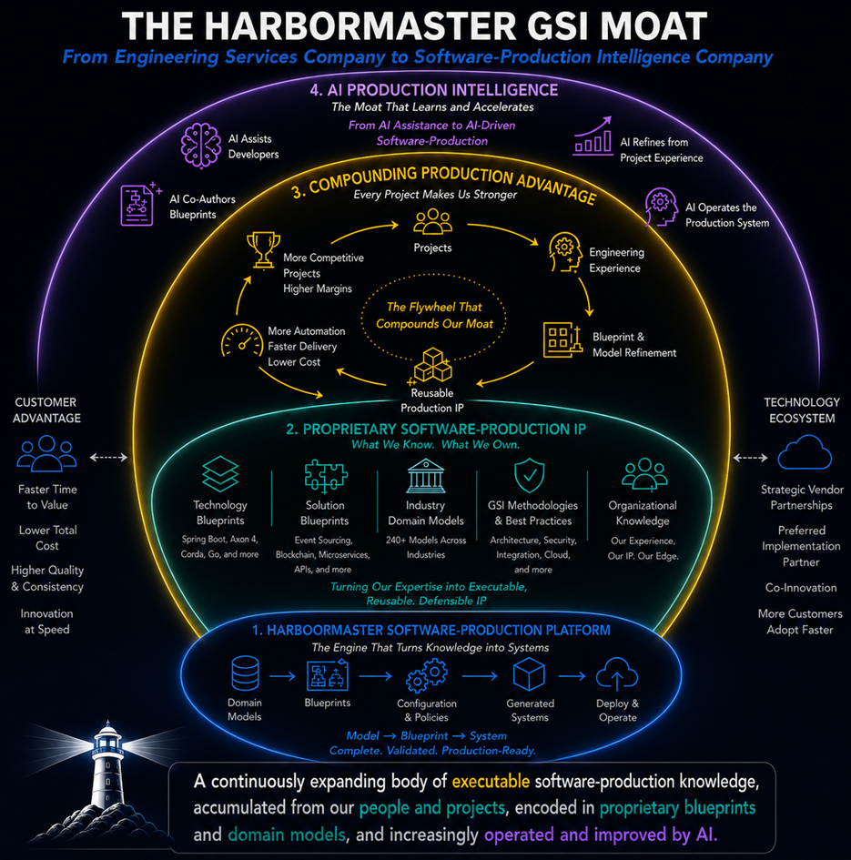

[<<< return](../README.md)

*From Engineering Services Company to Software-Production Intelligence Company*

> A set of hypotheses about how a GSI could turn accumulated engineering knowledge into reusable, executable software-production capability. Each hypothesis is intended to be examined against evidence.

## The Four-Layer Moat

1. **Layer 1 — Software-Production Platform** — *The Engine That Turns Knowledge into Systems*
2. **Layer 2 — Proprietary Software-Production IP** — *What We Know. What We Own.*
3. **Layer 3 — Compounding Production Advantage** — *Every Project Makes Us Stronger*
4. **Layer 4 — AI Production Intelligence** — *The Moat That Learns and Accelerates*

---

## Evidence Matrix

| Hypothesis                                                                           | Layer | Status | Evidence / description |
|--------------------------------------------------------------------------------------|---:|---|---|
| [H1-01 — Software production can be systematized](./layer-1/h1-01.md)                | 1 | Demonstrated | Blueprint, domain model, generated system |
| [H1-02 — Generation can produce production-ready systems](./layer-1/h1-02.md)        | 1 | Demonstrated | System-as-Code, Git repository, Docker image |
| [H1-03 — Production can be separated from individual developers](./layer-1/h1-03.md) | 1 | Partial | Blueprints, models and production rules |
| [H2-01 — Engineering expertise can become executable IP](./layer-2/h2-01.md)         | 2 | Demonstrated | Blueprint YAML, domain models |
| [H2-02 — Technology expertise can become technology blueprints](./layer-2/h2-02.md)  | 2 | Demonstrated | Spring Boot, Axon 4, Corda blueprints |
| [H2-03 — Solution knowledge can be encoded](./layer-2/h2-03.md)                      | 2 | Partial | Solution blueprint, generated system |
| [H2-04 — Industry knowledge can become reusable production IP](./layer-2/h2-04.md)   | 2 | Demonstrated | Industry domain models, generated systems |
| [H3-01 — Every project can improve the production system](./layer-3/h3-01.md)        | 3 | Future | Project-to-blueprint refinement examples |
| [H3-01 — Engineering capacity can decouple from headcount](./layer-3/h3-02.md)       | 3 | Future | Delivery measurements |
| [H3-02 — Revenue per engineer can increase](./layer-3/h3-03.md)                      | 3 | Future | Comparable project economics |
| [H3-03 — A GSI can create a blueprint factory](./layer-3/h3-04.md)                   | 3 | Future | Blueprint lifecycle and certification |
| [H4-01 — Structured production knowledge makes AI more valuable](./layer-4/h4-01.md) | 4 | Partial | Blueprints, models, generated systems |
| [H4-02 — AI can progress from assisting to authoring](./layer-4/h4-02.md)            | 4 | Future | AI progression illustration, blueprint examples |
| [H4-03 — A GSI can build AI-ready engineering knowledge](./layer-4/h4-03.md)         | 4 | Future | Accumulated blueprint and model repository |

---

## Hypothesis Index

Each hypothesis uses the same outline: **Summary, Implementation, Value — Today, Value — Tomorrow, Evidence, and Vision.**

- [H1-01 — Software Production Can Be Systematized](./layer-1/h1-01.md) — Layer 1 · Platform
- [H1-02 — Generation Can Produce Production-Ready Systems](./layer-1/h1-02.md) — Layer 1 · Platform
- [H1-03 — Production Can Be Separated From Individual Developers](./layer-1/h1-03.md) — Layer 1 · Platform
- [H2-01 — Engineering Expertise Can Become Executable IP](./layer-2/h1-04.md) — Layer 2 · Proprietary IP
- [H2-02 — Technology Expertise Can Become Technology Blueprints](./layer-2/h2-01.md) — Layer 2 · Proprietary IP
- [H2-03 — Solution Knowledge Can Be Encoded](./layer-2/h2-02.md) — Layer 2 · Proprietary IP
- [H2-04 — Industry Knowledge Can Become Reusable Production IP](./layer-2/h2-03.md) — Layer 2 · Proprietary IP
- [H3-01 — Every Project Can Improve the Production System](./layer-3/h3-01.md) — Layer 3 · Compounding Advantage
- [H3-02 — Engineering Capacity Can Decouple From Headcount](./layer-3/h3-02.md) — Layer 3 · Compounding Advantage
- [H3-03 — Revenue Per Engineer Can Increase](./layer-3/h3-03.md) — Layer 3 · Compounding Advantage
- [H3-04 — A GSI Can Create a Blueprint Factory](./layer-3/h3-04.md) — Layer 3 · Compounding Advantage
- [H4-01 — Structured Production Knowledge Makes AI More Valuable](./layer-4/h4-01.md) — Layer 4 · AI Intelligence
- [H4-02 — AI Can Progress From Assisting To Authoring](./layer-4/h4-01.md) — Layer 4 · AI Intelligence
- [H4-03 — A GSI Can Build AI-Ready Engineering Knowledge](./layer-4/h4-03.md) — Layer 4 · AI Intelligence

## Closing

> *A continuously expanding body of executable software-production knowledge, accumulated from our people and projects, encoded in proprietary blueprints and domain models, and increasingly operated and improved by AI.*

[<<< return](../README.md)
