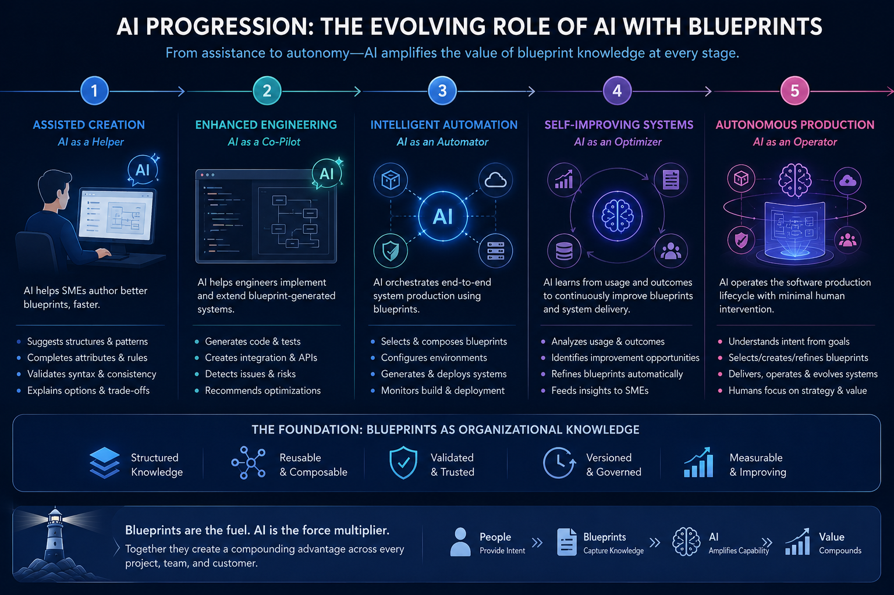

## H13· LAYER 4 — AI Can Progress From Assisting to Authoring

> **Hypothesis:** As production knowledge becomes structured and validated, AI can progress from assisting developers toward recommending, verifying and eventually authoring production blueprints.

### Summary

The target is not simply more AI-generated source code; it is AI participation in creating the production knowledge that generates systems.

### Implementation

Assist → Recommend → Verify → Author, with validation against requirements and organizational standards.

### Value — Today

AI can assist with content, options and implementation.

### Value — Tomorrow

AI can increasingly create and refine blueprints under organizational constraints.

### Evidence

 
[Blueprint Example](../../evidence/blueprint/golang)

### Vision

AI increasingly participates in software architecture and production at the blueprint level.

[<<< return](../../moat/moat.md)