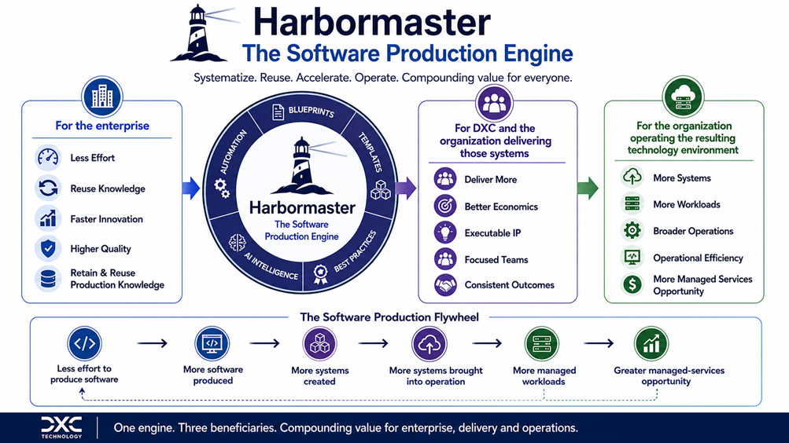
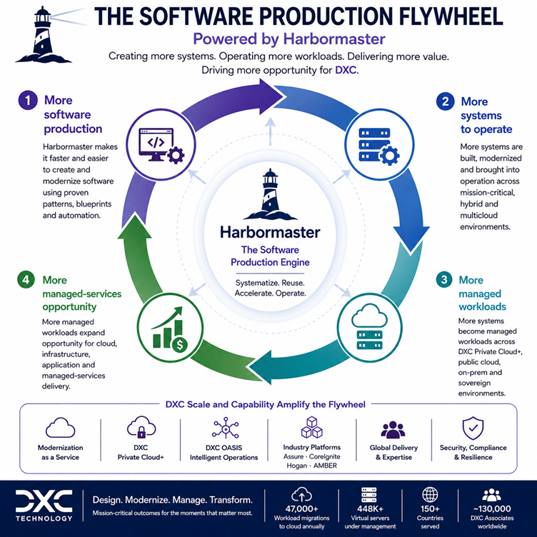
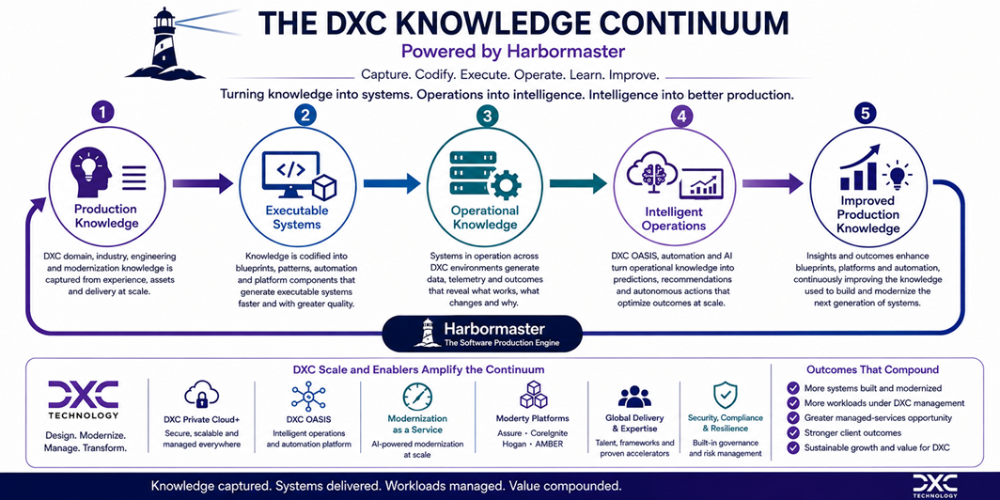

# Why We Built Harbormaster

Harbormaster was built around a simple observation: organizations that create software systems repeatedly are continually recreating much of the knowledge, architecture, engineering effort, and production infrastructure required to build them.

That creates three opportunities.

**For the enterprise**, production knowledge can be captured and reused so that new and modernized systems require progressively less effort to create.

**For DXC and the organization delivering those systems**, accumulated technology, architecture, application, infrastructure and industry expertise can become executable production capability—allowing focused teams to deliver more with less production effort while improving the economics of each engagement.

**For the organization operating the resulting technology environment**, making software production more efficient can increase the number of systems that are created, modernized and brought into managed operation—expanding the opportunity for cloud, infrastructure, application and managed-services operations.

Harbormaster brings these three effects together:

The value does not depend on any one of these outcomes occurring in isolation. **The same production capability can create economic value for the enterprise, for DXC's delivery organization, and for the managed technology environments that DXC designs, operates and transforms.**

# The Four-Layer DXC Moat

## Layer 1 — Enterprise Software Production

### Make Enterprise Software Easier to Create and Modernize

Harbormaster becomes a production capability that enterprises can use to create new systems and progressively modernize existing ones with less production effort.

This aligns particularly well with DXC's **Modernization as a Service**, which combines AI-assisted code conversion, cloud-native re-architecture and outcome-based delivery. DXC's modernization approach is explicitly designed to transform legacy estates into modern, cloud-native platforms. :contentReference[oaicite:1]{index=1}

DXC also brings substantial industry-specific software knowledge through platforms such as **DXC Assure, CoreIgnite, Hogan and AMBER**, creating potential starting points for reusable production knowledge across insurance, financial services and automotive software. :contentReference[oaicite:2]{index=2}

**Hypotheses**

- **[H1-01](./layer-1/h1-01.md) — Enterprise system production can be systematized**
- **[H1-02](./layer-1/h1-02.md) — Existing systems can be modernized through executable production knowledge**
- **[H1-03](./layer-1/h1-03.md) — Blueprint coverage can progressively reduce the effort required to create and modernize enterprise systems**
- **[H1-04](./layer-1/h1-04.md) — Enterprises can retain and reuse production knowledge beyond individual projects**
- **[H1-05](./layer-1/h1-05.md) — Enterprises can be encouraged to use DXC services and capabilities around systems produced through the platform**

---

## Layer 2 — DXC Production Advantage

### Turn DXC Expertise Into Reusable Production Capability

DXC's accumulated application, infrastructure, cloud, modernization, architecture and industry expertise becomes reusable production IP that can improve the economics of successive engagements.

This is particularly relevant to DXC because its portfolio already combines **application modernization, managed infrastructure, cloud transformation and industry-specific software**. Harbormaster provides a potential mechanism for moving some of that expertise from services delivered by individual teams into reusable, executable production capability. :contentReference[oaicite:3]{index=3}

DXC's industry platforms provide another potential source of production knowledge. **Assure** carries extensive insurance-domain capabilities, while **CoreIgnite, Hogan and AMBER** encode domain and technology knowledge into reusable software platforms. :contentReference[oaicite:4]{index=4}

**Hypotheses**

- **[H2-01](./layer-2/h2-01.md) — DXC engineering, modernization and industry expertise can become executable production IP**
- **[H2-02](./layer-2/h2-02.md) — The same production knowledge can improve the economics of successive engagements**
- **[H2-03](./layer-2/h2-03.md) — Smaller, focused teams can deliver systems that previously required larger delivery teams**
- **[H2-04](./layer-2/h2-04.md) — Lower production costs can improve both client economics and DXC delivery margins**

---

## Layer 3 — Software-to-Managed-Services Conversion

### Convert More Software Production Into More Managed Workloads

The production advantage creates a second-order effect: when software becomes cheaper and faster to create and modernize, more software becomes economically viable to build, modernize and operate.

For DXC, this opportunity is particularly relevant because the company operates substantial managed infrastructure and cloud environments across public cloud, private cloud, hybrid environments and mission-critical enterprise systems.

**DXC Private Cloud+** combines private-cloud infrastructure with DXC managed services, unified tooling and automation across hybrid and sovereign environments. DXC reports 800+ private-cloud customers and 150+ data centers supporting its private-cloud business. :contentReference[oaicite:5]{index=5}

DXC also reports **448K+ virtual servers under management** and **47,000 workload migrations to cloud every year**, providing an existing operational base against which additional software production could translate into managed workloads. :contentReference[oaicite:6]{index=6}

The resulting economic mechanism is therefore:

**Hypotheses**

- **[H3-01](./layer-3/h3-01.md) — Lower production cost increases the number of economically viable software projects**
- **[H3-02](./layer-3/h3-02.md) — New and modernized systems create additional workloads that require ongoing operation**
- **[H3-03](./layer-3/h3-03.md) — A greater proportion of those workloads can become DXC-managed workloads**
- **[H3-04](./layer-3/h3-04.md) — Increased software production translates into measurable incremental managed-services demand**

---

## Layer 4 — Compounding Software-Production Intelligence

### Turn DXC's Technology and Operational Knowledge Into an Increasingly Intelligent Production System

The enterprise systems, delivery experience, industry platforms, blueprints and production outcomes create a structured body of knowledge that can progressively improve production capability and increasingly be extended and operated by AI.

This layer has a particularly strong connection to **DXC OASIS**.

DXC describes OASIS as an intelligent orchestration platform and new managed-services operating model that connects an organization's IT estate into a unified view, combining agentic AI with human expertise for mission-critical operations. DXC cites more than seven million devices under management and six decades of operational experience as part of the foundation for OASIS. :contentReference[oaicite:7]{index=7}

Harbormaster potentially extends this trajectory upstream—from operating and modernizing systems toward **encoding the knowledge used to create those systems in the first place**.

The resulting continuum is:

DXC's existing industry platforms also provide potential structured production knowledge for this continuum. Assure, for example, combines cloud hosting, integration, automation, AI-enabled operational insight and modernization capabilities for insurance systems. :contentReference[oaicite:8]{index=8}

**Hypotheses**

- **[H4-01](./layer-4/h4-01.md) — Production outcomes can improve the blueprints used for subsequent systems**
- **[H4-02](./layer-4/h4-02.md) — A growing blueprint continuum increases the range of systems that can be produced**
- **[H4-03](./layer-4/h4-03.md) — AI can increasingly extend and author production knowledge as the structured corpus grows**
- **[H4-04](./layer-4/h4-04.md) — Accumulated production intelligence can simultaneously improve enterprise production, DXC delivery economics and managed-services opportunity**
- **[H4-05](./layer-4/h4-05.md) — ISVs and technology partners can create blueprints that accelerate adoption and usage of their technologies through DXC's delivery and managed-services ecosystem**