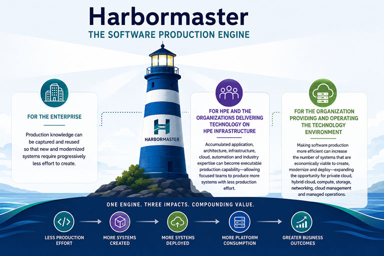
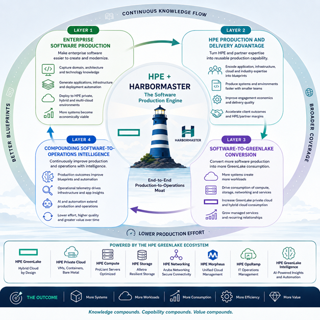
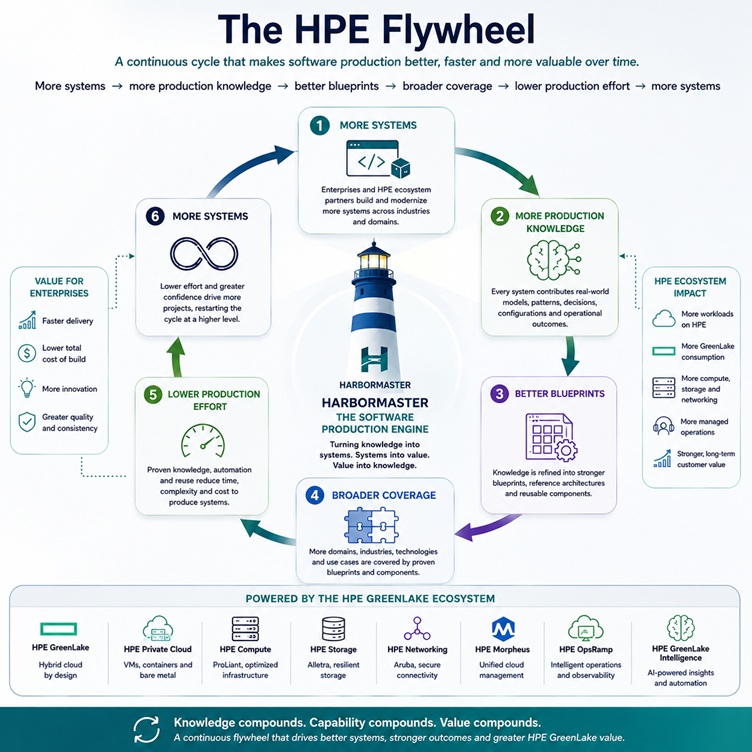

# Why We Built Harbormaster

Harbormaster was built around a simple observation: organizations that create software systems repeatedly are continually recreating much of the knowledge, architecture, engineering effort, and production infrastructure required to build them.

That creates three opportunities.

**For the enterprise**, production knowledge can be captured and reused so that new and modernized systems require progressively less effort to create.

**For HPE and the organizations delivering technology on HPE infrastructure**, accumulated application, architecture, infrastructure, cloud, automation and industry expertise can become executable production capability—allowing focused teams to produce more systems with less production effort.

**For the organization providing and operating the technology environment**, making software production more efficient can increase the number of systems that are economically viable to create, modernize and deploy—expanding the opportunity for private cloud, hybrid cloud, compute, storage, networking, cloud management and managed operations.

Harbormaster brings these effects together:

> **Lower software-production effort → more systems produced → more workloads deployed → more infrastructure consumed → more systems operated → more operational knowledge → better production and operations.**

The value does not depend on any one of these outcomes occurring in isolation. **The same production capability can create economic value for the enterprise, for the organizations delivering the systems, and for the technology environment in which those systems are deployed and operated.**

For HPE, this creates a particularly relevant connection between **Harbormaster's software-production capability** and HPE's **GreenLake hybrid-cloud operating model**.

HPE GreenLake provides cloud services across private and hybrid environments, including HPE Private Cloud, while HPE's portfolio encompasses compute, storage, networking, CloudOps and managed services. HPE Private Cloud Enterprise, for example, provides a managed private-cloud environment supporting bare metal, virtual machines and container workloads on common infrastructure, with integration to public clouds including AWS, Microsoft Azure and Google Cloud.

The strategic opportunity can therefore be expressed as:

> **Harbormaster produces the systems. HPE GreenLake provides the environment in which those systems are consumed, managed and operated.**

# The Four-Layer HPE GreenLake Moat

## Layer 1 — Enterprise Software Production

### Make Enterprise Software Easier to Create and Modernize

Harbormaster becomes a production capability that enterprises can use to create new systems and progressively modernize existing ones with less production effort.

The capability captures domain knowledge, architecture, technology choices, infrastructure requirements and deployment patterns as reusable production knowledge. That knowledge can then be applied repeatedly rather than recreated manually for every project.

For HPE, the important distinction is that the resulting systems do not have to be tied to a single public cloud. HPE's GreenLake portfolio is explicitly designed around hybrid and private environments, while HPE Private Cloud provides a managed cloud experience for **bare-metal, container and virtual-machine workloads**. HPE also provides integrations with public clouds and existing infrastructure, allowing the resulting applications to participate in a broader hybrid environment.

This creates a direct connection between software production and HPE's platform:

**More efficient application production**

→ **more economically viable systems**

→ **more workloads requiring deployment**

→ **greater opportunity for HPE private and hybrid cloud**

The opportunity therefore extends beyond generating application code. Harbormaster can potentially generate the application together with the infrastructure and deployment configuration required to place it into an HPE-supported hybrid environment.

HPE GreenLake for Private Cloud Enterprise also provides infrastructure-as-code capabilities through its Terraform provider, allowing infrastructure resources to be managed programmatically. This creates a natural technical adjacency with Harbormaster's ability to generate complete deployment configurations.

**Hypotheses**

* **[H1-01](./layer-1/h1-01.md) — Enterprise system production can be systematized**
* **[H1-02](./layer-1/h1-02.md) — Existing systems can be modernized through executable production knowledge**
* **[H1-03](./layer-1/h1-03.md) — Blueprint coverage can progressively reduce the effort required to create and modernize enterprise systems**
* **[H1-04](./layer-1/h1-04.md) — Enterprises can retain and reuse production knowledge beyond individual projects**
* **[H1-05](./layer-1/h1-05.md) — Enterprises can be encouraged to use HPE platform and service capabilities around systems produced through the platform**

---

## Layer 2 — HPE Production and Delivery Advantage

### Turn Application, Infrastructure and Cloud Expertise Into Reusable Production Capability

HPE's expertise spans more than infrastructure hardware. Its current portfolio combines **compute, storage, networking, private cloud, CloudOps, hybrid-cloud consulting and managed services**. HPE also maintains a substantial ecosystem of solution and service providers that build businesses around GreenLake.

Harbormaster provides a potential mechanism for turning portions of this accumulated expertise into executable production IP.

A production blueprint could capture not only an application's domain and architecture, but also the environment required to operate it:

* application architecture
* infrastructure architecture
* Kubernetes/container configuration
* compute requirements
* storage requirements
* network requirements
* security configuration
* hybrid-cloud placement
* deployment automation
* infrastructure-as-code
* operational requirements

This changes the unit of production.

Instead of producing:

> **Application**

the organization can increasingly produce:

> **Application + infrastructure + deployment + operational configuration**

That distinction is important for HPE because GreenLake is designed to make infrastructure consumption and hybrid-cloud operations more standardized and accessible. GreenLake Flex Solutions provide consumption-based infrastructure and cloud services, while HPE's partner ecosystem allows solution and service providers to build their own services around the platform.

HPE's relationship with major service providers further demonstrates this model. Its alliance with Accenture, for example, combines consulting, integration and managed services with HPE technologies including GreenLake, HPE Private Cloud and HPE Morpheus Software.

Harbormaster can potentially strengthen this model by making the **production of the application and its target environment increasingly repeatable**.

**Hypotheses**

* **[H2-01](./layer-2/h2-01.md) — HPE engineering, infrastructure, cloud and partner expertise can become executable production IP**
* **[H2-02](./layer-2/h2-02.md) — The same production knowledge can improve the economics of successive engagements**
* **[H2-03](./layer-2/h2-03.md) — Smaller, focused teams can deliver systems and environments that previously required larger delivery teams**
* **[H2-04](./layer-2/h2-04.md) — Lower production costs can improve both client economics and HPE or partner delivery margins**

---

## Layer 3 — Software-to-GreenLake Conversion

### Convert More Software Production Into More Hybrid-Cloud Workloads

The production advantage creates a second-order effect: when software becomes cheaper and faster to create and modernize, more software becomes economically viable to build, deploy and operate.

For HPE, this is the critical conversion point.

HPE GreenLake is designed around a consumption model in which infrastructure and cloud resources can be consumed as services. HPE GreenLake for Private Cloud Enterprise supports bare-metal, virtual-machine and container workloads, while its consumption analytics provide visibility into usage, cost and capacity across private and hybrid environments.

Consequently, additional software production can create additional demand across several layers of the HPE platform:

**Applications**

→ **containers / VMs / bare metal**

→ **compute**

→ **storage**

→ **networking**

→ **private cloud**

→ **hybrid-cloud management**

→ **managed operations**

The relationship is therefore not simply:

> **More applications → more cloud.**

It is:

> **Lower production cost → more economically viable systems → more workloads → more infrastructure consumption → more GreenLake consumption.**

HPE's GreenLake portfolio already includes workload-optimized infrastructure, private cloud, CloudOps and container solutions. HPE also supports technologies such as **Red Hat OpenShift** within GreenLake Flex Solutions, allowing Harbormaster-generated systems to participate in heterogeneous enterprise environments rather than requiring a single runtime or cloud provider.

This is important because Harbormaster is not dependent on HPE owning the application runtime. Its value comes from increasing the number and repeatability of systems that ultimately require a place to run.

**Hypotheses**

* **[H3-01](./layer-3/h3-01.md) — Lower production cost increases the number of economically viable software projects**
* **[H3-02](./layer-3/h3-02.md) — New and modernized systems create additional workloads**
* **[H3-03](./layer-3/h3-03.md) — A greater proportion of those workloads can be deployed into HPE private and hybrid-cloud environments**
* **[H3-04](./layer-3/h3-04.md) — Increased software production translates into measurable incremental compute, storage, networking and platform consumption**

---

## Layer 4 — Compounding Software-to-Operations Intelligence

### Connect Software Production, Infrastructure Operations and AI Into a Continuously Improving System

The enterprise systems, delivery experience, infrastructure configurations, blueprints and production outcomes create a structured body of knowledge that can progressively improve both software production and the operation of the resulting environments.

This creates a second intelligence loop around the HPE platform.

Harbormaster captures knowledge about **how systems are designed and produced**.

HPE's operational platforms capture knowledge about **how those systems and their infrastructure behave in production**.

HPE is already extending GreenLake toward this model through **GreenLake Intelligence**, HPE Morpheus Software, HPE OpsRamp and its broader CloudOps portfolio.

HPE describes GreenLake Intelligence as an agentic-AI framework for hybrid IT operations, with capabilities for workload optimization, observability, networking, cloud costs and other operational functions. In 2026, HPE expanded this strategy with additional agentic orchestration and unified control-plane capabilities in HPE Morpheus Software.

HPE's current managed-services portfolio also extends across monitoring, operations, administration and optimization, including managed application operations for Kubernetes.

Harbormaster therefore has the potential to extend the intelligence continuum **upstream into software production**.

The resulting continuous flow is:

> **More systems → more production knowledge → better blueprints → broader coverage → lower production effort → more systems.**

At the operational layer:

> **More workloads → more operational knowledge → better automation → better infrastructure utilization → lower operational effort → more workloads.**

Together, these create an end-to-end production-to-operations system:

> **Produce the system → provision the environment → deploy the workload → operate it → learn from it → improve the production blueprint → produce the next system more efficiently.**

This is where the Harbormaster/HPE relationship can become more than a deployment integration.

Harbormaster can provide the **production intelligence**.

HPE GreenLake, Morpheus, OpsRamp and related services can provide the **infrastructure and operational intelligence**.

AI can increasingly connect the two.

The result is a potential closed-loop enterprise technology system in which software production, infrastructure provisioning, workload deployment and ongoing operations continuously improve one another.

**Hypotheses**

* **[H4-01](./layer-4/h4-01.md) — Production outcomes can improve the blueprints used for subsequent systems**
* **[H4-02](./layer-4/h4-02.md) — A growing blueprint continuum increases the range of systems that can be produced**
* **[H4-03](./layer-4/h4-03.md) — AI can increasingly extend and author production knowledge as the structured corpus grows**
* **[H4-04](./layer-4/h4-04.md) — Accumulated production intelligence can simultaneously improve enterprise production, delivery economics, infrastructure utilization and managed-services opportunity**
* **[H4-05](./layer-4/h4-05.md) — ISVs and technology partners can create blueprints that accelerate adoption and consumption of their technologies through the HPE GreenLake ecosystem**

---

# The HPE End-to-End Production-to-Operations Story

The four layers form a continuous economic and technological chain:

### 1. Produce

**Harbormaster**

Captures enterprise, application, architectural and infrastructure knowledge and turns it into executable production capability.

↓

### 2. Provision

**HPE GreenLake / HPE Private Cloud / CloudOps**

Provides the target environment and automates the provisioning and management of the infrastructure required by the system.

↓

### 3. Deploy

**HPE Compute + Storage + Networking + Kubernetes / Containers / VMs**

The generated systems become actual workloads consuming infrastructure resources.

↓

### 4. Operate

**HPE Managed Services + Morpheus + OpsRamp + GreenLake Intelligence**

The workloads and underlying infrastructure become part of an increasingly automated hybrid-cloud operating environment.

↓

### 5. Learn

**Operational and production outcomes**

Production and operational experience generates additional knowledge about how systems should be designed, deployed and operated.

↓

### 6. Improve

**Harbormaster Blueprints + HPE Intelligent Operations**

The accumulated knowledge improves future production and operations.

↓

### 7. Repeat

**More systems → more workloads → more consumption → more operational knowledge → better production**

This creates the central HPE/Harbormaster thesis:

> **Harbormaster increases the supply of enterprise software. HPE GreenLake provides the hybrid-cloud environment that converts that additional software production into infrastructure consumption, managed workloads and ongoing operations.**

The strategic opportunity is therefore not simply to make applications faster to build.

It is to connect **software production to the entire lifecycle of enterprise technology**:

> **Production → Provisioning → Deployment → Consumption → Operations → Intelligence → Production**

That is the **HPE GreenLake moat**.

---

# Explore Operational and Economic Drivers

Discover the full benefits of Harbormaster to the HPE ecosystem.

[Explore Drivers](../drivers.md)
