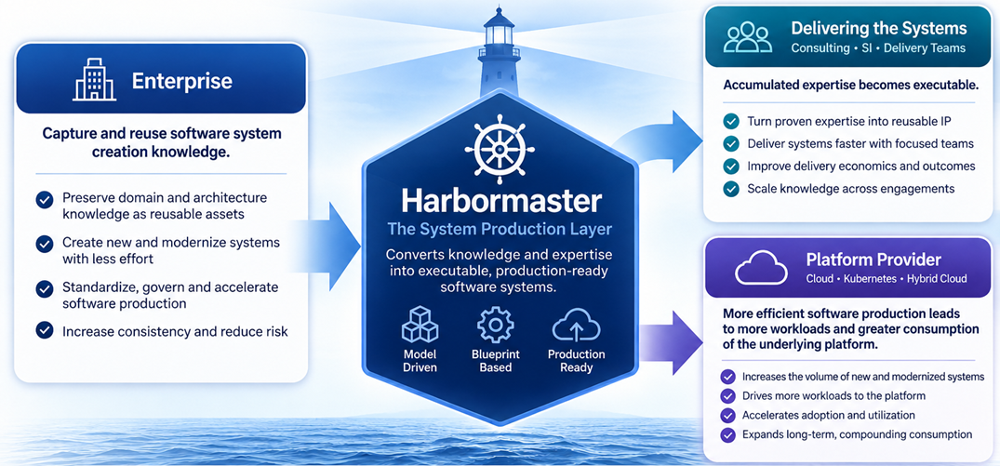
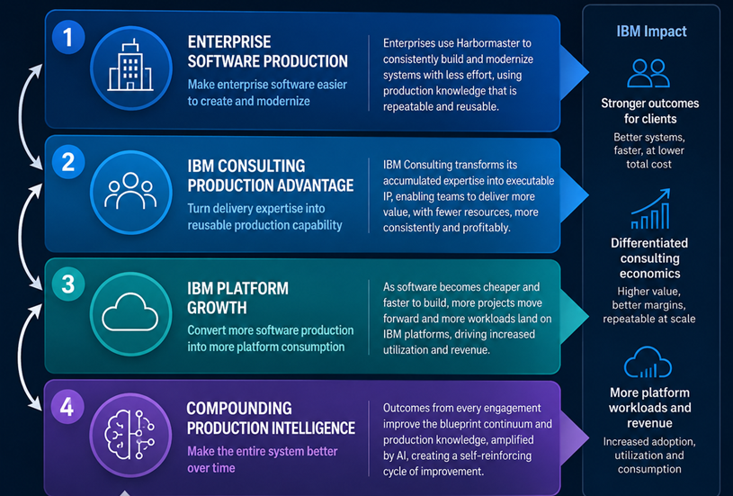
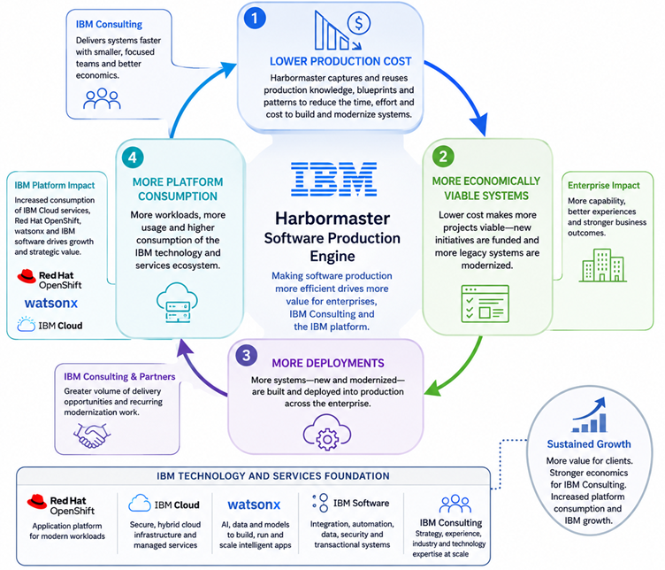
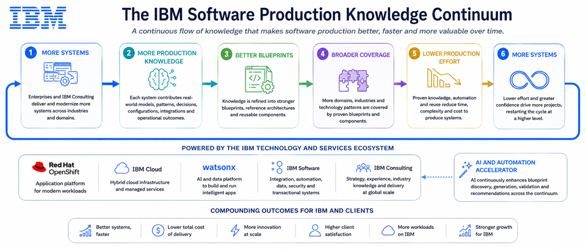

# Why We Built Harbormaster

Harbormaster was built around a simple observation: organizations that create software systems repeatedly are continually recreating much of the knowledge, architecture, engineering effort, and production infrastructure required to build them.

That creates three opportunities.

**For the enterprise**, production knowledge can be captured and reused so that new and modernized systems require progressively less effort to create.

**For the organization delivering those systems**, accumulated expertise can become executable production capability—allowing focused teams to deliver more with less production effort while improving the economics of each engagement.

**For the organization providing the technology platform**, making software production more efficient can increase the amount of software that is created, modernized and deployed, resulting in more workloads and greater consumption of the underlying platform.

Harbormaster brings these three effects together:

> **Less effort to produce software → more software produced → more systems deployed → greater utilization of the technology platform.**

The value does not depend on any one of these outcomes occurring in isolation. **The same production capability can create economic value for the enterprise, the organization delivering the software, and the platform supporting it.**

For IBM, this creates a particularly important opportunity because IBM participates across all three economic layers. **IBM Consulting** creates and modernizes enterprise software; **Red Hat OpenShift** provides a strategic application platform on which those systems can run; **IBM Cloud** provides infrastructure and cloud services; and IBM's software portfolio—including technologies such as **watsonx, API Connect, MQ, Event Streams and other enterprise capabilities**—can become part of the systems being produced.

Harbormaster therefore has the potential to connect software production directly to the IBM technology and services ecosystem:

> **More efficient software production → more enterprise systems → more IBM Consulting opportunity → more OpenShift and cloud workloads → more consumption of IBM technology.**

# The Four-Layer IBM Moat

## Layer 1 — Enterprise Software Production

### Make Enterprise Software Easier to Create and Modernize

Harbormaster becomes a production capability that enterprises can use to create new systems and progressively modernize existing ones with less production effort.

The fundamental asset is not simply generated source code. Harbormaster captures **structured production knowledge**—domain models, architectural patterns, technology blueprints, configuration, infrastructure requirements and deployment knowledge—and turns that knowledge into executable system production.

For an IBM enterprise, this could encompass systems built around **Spring Boot, Java, OpenShift, APIs, event-driven architectures, databases, integration technologies and IBM software capabilities**, while also supporting modernization of existing enterprise application estates.

The objective is not to eliminate enterprise architecture or engineering. It is to make the decisions and knowledge that have already been proven effective **repeatable and executable**.

For IBM, this layer creates the enterprise-side demand that can feed the rest of the moat. The more enterprise systems that can be produced or modernized economically, the larger the opportunity for IBM Consulting and the greater the potential workload available to IBM's software and cloud platforms.

**Hypotheses**

* **[H1-01](./layer-1/h1-01.md) — Enterprise system production can be systematized**
* **[H1-02](./layer-1/h1-02.md) — Existing systems can be modernized through executable production knowledge**
* **[H1-03](./layer-1/h1-03.md) — Blueprint coverage can progressively reduce the effort required to create enterprise systems**
* **[H1-04](./layer-1/h1-04.md) — Enterprises can retain and reuse production knowledge beyond individual projects**
* **[H1-05](./layer-1/h1-05.md) — Enterprises will be encouraged to use the services and capabilities of the platform that creates the system**

---

## Layer 2 — Consulting Production Advantage

### Turn Delivery Expertise Into Reusable Production Capability

The organization's accumulated technology, architecture, solution and industry expertise becomes reusable production IP that improves the economics of software delivery.

This is particularly important for a GSI such as **IBM Consulting**. A large consulting organization repeatedly solves similar classes of problems across industries, clients and geographies. Much of that experience is valuable, but traditionally remains distributed across people, project artifacts, methodologies, templates and individual expertise.

Harbormaster provides a mechanism for converting a portion of that accumulated knowledge into **executable production IP**.

An IBM Consulting organization could potentially encode proven patterns around application architecture, industry domains, integration, modernization, APIs, event-driven systems, security, data access, deployment and OpenShift into reusable blueprints.

That changes the economics of delivery.

Instead of every engagement beginning with a largely manual production process, successive engagements can begin with an increasingly mature body of executable knowledge. A smaller or more focused team can potentially produce more systems, while senior architects and subject-matter experts can influence many more engagements through the blueprints they create.

For IBM, this creates a direct connection between Harbormaster and **Consulting margin, delivery capacity and revenue opportunity**. The value is not merely that IBM can deliver an individual project faster; it is that the organization's accumulated expertise can become a reusable production asset.

**Hypotheses**

* **[H2-01](./layer-2/h2-01.md) — Consulting expertise can become executable production IP**
* **[H2-02](./layer-2/h2-02.md) — The same production knowledge can improve the economics of successive engagements**
* **[H2-03](./layer-2/h2-03.md) — Smaller, focused teams can deliver systems that previously required larger delivery teams**
* **[H2-04](./layer-2/h2-04.md) — Lower production costs can improve both client economics and delivery margins**

---

## Layer 3 — Software-to-Platform Conversion

### Convert More Software Production Into More Platform Consumption

The production advantage creates a second-order effect: when software becomes cheaper and faster to create and modernize, more software becomes economically viable to build and deploy.

This is where Harbormaster becomes particularly relevant to a technology platform provider such as IBM.

If the cost and effort required to produce a system decline, organizations can pursue systems that previously were postponed, reduced in scope, or considered uneconomic. Existing systems can also be modernized rather than simply maintained.

Each additional system can become an additional workload.

For IBM, those workloads can create demand across the broader platform ecosystem: **Red Hat OpenShift** for application deployment and container orchestration; **IBM Cloud** for infrastructure and managed cloud services; and IBM software and middleware capabilities used within the resulting applications and integration architectures.

The important economic mechanism is therefore not simply that Harbormaster makes an individual application cheaper to produce.

It is:

This creates a potential flywheel in which IBM Consulting's ability to produce systems more efficiently can increase the number of systems entering the IBM technology ecosystem.

The platform therefore benefits from the productivity improvement rather than being economically disadvantaged by it.

**Hypotheses**

* **[H3-01](./layer-3/h3-01.md) — Lower production cost increases the number of economically viable software projects**
* **[H3-02](./layer-3/h3-02.md) — New and modernized systems create additional workloads**
* **[H3-03](./layer-3/h3-03.md) — A greater proportion of those workloads can be deployed onto the organization's technology platform**
* **[H3-04](./layer-3/h3-04.md) — Increased software production translates into measurable incremental resource consumption**

---

## Layer 4 — Compounding Software-Production Intelligence

### Make the Entire System Better Over Time

The enterprise systems, delivery experience, blueprints and production outcomes create a structured body of knowledge that can progressively improve production capability and eventually be operated increasingly by AI.

This is the layer that gives Harbormaster the potential to become more than a productivity tool.

Every successfully produced system can contribute additional knowledge about **domain structure, architecture, implementation patterns, technology choices, configuration, deployment and operational outcomes**. That knowledge can be incorporated into subsequent blueprints and production processes.

The result is a compounding system:

For IBM, this creates a potential connection to the company's AI strategy, including **watsonx and enterprise AI capabilities**. As the structured production corpus grows, AI can increasingly assist with extending blueprints, identifying reusable patterns, generating configurations, adapting systems to new requirements and eventually participating in more of the production lifecycle.

The strategic value is therefore not simply the productivity achieved today. It is the possibility of creating an **ever-growing organizational production asset** whose value increases as more systems are produced.

That creates a potential moat around both the consulting organization and the platform ecosystem: accumulated production intelligence can simultaneously improve IBM's ability to deliver systems, increase the range of workloads it can support, and strengthen the relationship between software production and IBM technology consumption.

**Hypotheses**

* **[H4-01](./layer-4/h4-01.md) — Production outcomes can improve the blueprints used for subsequent systems**
* **[H4-02](./layer-4/h4-02.md) — A growing blueprint continuum increases the range of systems that can be produced**
* **[H4-03](./layer-4/h4-03.md) — AI can increasingly extend and author production knowledge as the structured corpus grows**
* **[H4-04](./layer-4/h4-04.md) — Accumulated production intelligence can simultaneously improve enterprise production, delivery economics and platform consumption**
* **[H4-05](./layer-4/h4-05.md) — ISVs will drive software production by creating blueprints to accelerate adoption and usage of their technology**
