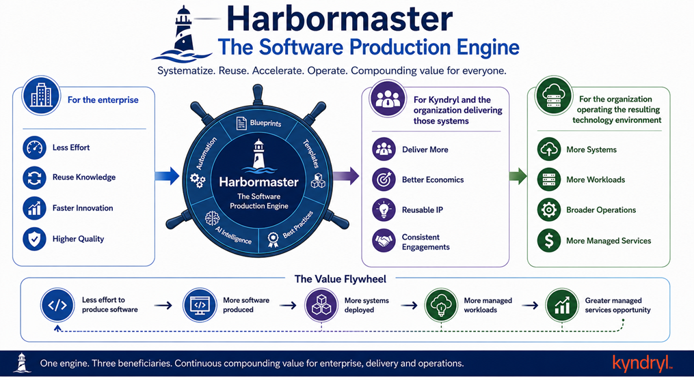
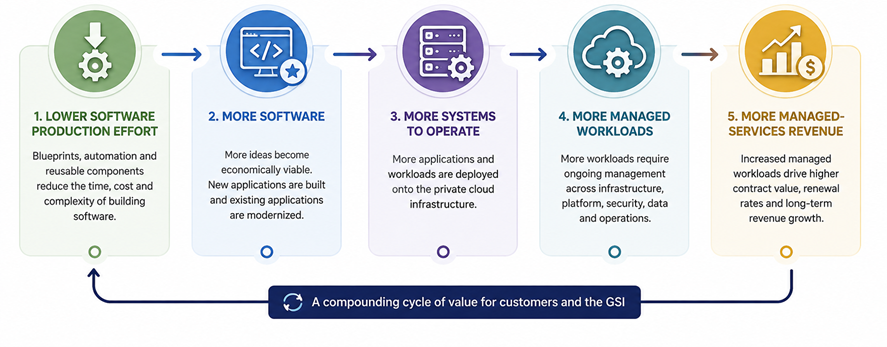
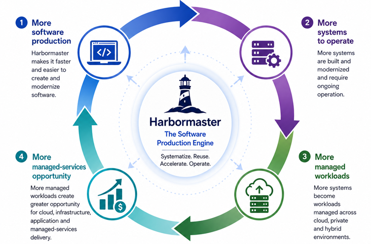
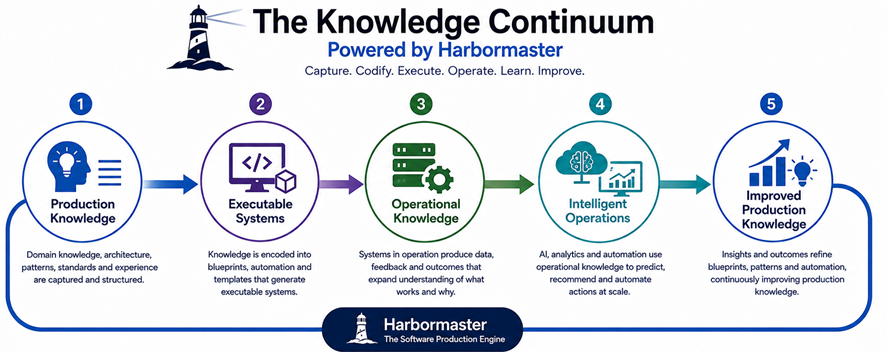

# Why We Built Harbormaster

Harbormaster was built around a simple observation: organizations that create software systems repeatedly are continually recreating much of the knowledge, architecture, engineering effort, and production infrastructure required to build them.

That creates three opportunities.

**For the enterprise**, production knowledge can be captured and reused so that new and modernized systems require progressively less effort to create.

**For Kyndryl and the organization delivering those systems**, accumulated technology, architecture, application, infrastructure and industry expertise can become executable production capability—allowing focused teams to deliver more with less production effort while improving the economics of each engagement.

**For the organization operating the resulting technology environment**, making software production more efficient can increase the number of systems that are created, modernized and brought into managed operation—expanding the opportunity for cloud, infrastructure, application and managed-services operations.

Harbormaster brings these three effects together:

The value does not depend on any one of these outcomes occurring in isolation. **The same production capability can create economic value for the enterprise, for Kyndryl's delivery organization, and for the managed technology environments that Kyndryl designs, operates and transforms.**

# The Four-Layer Kyndryl Moat

## Layer 1 — Enterprise Software Production

### Make Enterprise Software Easier to Create and Modernize

Harbormaster becomes a production capability that enterprises can use to create new systems and progressively modernize existing ones with less production effort.

This aligns directly with Kyndryl's Application Services and Application Modernization capabilities, which span application assessment, modernization, migration and management across hybrid, multicloud and distributed environments. Kyndryl's current modernization approach also uses AI, automation, security and governance across the application lifecycle. :contentReference[oaicite:1]{index=1}

**Hypotheses**

- **[H1-01](./layer-1/h1-01.md) — Enterprise system production can be systematized**
- **[H1-02](./layer-1/h1-02.md) — Existing systems can be modernized through executable production knowledge**
- **[H1-03](./layer-1/h1-03.md) — Blueprint coverage can progressively reduce the effort required to create and modernize enterprise systems**
- **[H1-04](./layer-1/h1-04.md) — Enterprises can retain and reuse production knowledge beyond individual projects**
- **[H1-05](./layer-1/h1-05.md) — Enterprises can be encouraged to use Kyndryl services and capabilities around systems produced through the platform**

---

## Layer 2 — Kyndryl Production Advantage

### Turn Kyndryl Expertise Into Reusable Production Capability

Kyndryl's accumulated infrastructure, application, cloud, architecture, industry and operational expertise becomes reusable production IP that can improve the economics of successive engagements.

This builds directly on **Kyndryl Consult**, Kyndryl's application services, its infrastructure-first heritage and its extensive technology alliances. Kyndryl describes its advantage in terms of operational knowledge, experts and alliances built through decades of operating complex technology environments. :contentReference[oaicite:2]{index=2}

Harbormaster provides a potential mechanism for moving some of that knowledge from expertise exercised by individuals into reusable, executable production capability.

**Hypotheses**

- **[H2-01](./layer-2/h2-01.md) — Kyndryl consulting, engineering and operational expertise can become executable production IP**
- **[H2-02](./layer-2/h2-02.md) — The same production knowledge can improve the economics of successive engagements**
- **[H2-03](./layer-2/h2-03.md) — Smaller, focused teams can deliver systems that previously required larger delivery teams**
- **[H2-04](./layer-2/h2-04.md) — Lower production costs can improve both client economics and Kyndryl delivery margins**

---

## Layer 3 — Software-to-Managed-Services Conversion

### Convert More Software Production Into More Managed Workloads

The production advantage creates a second-order effect: when software becomes cheaper and faster to create and modernize, more software becomes economically viable to build, modernize and operate.

For Kyndryl, this opportunity is particularly relevant because the company operates across **public cloud, private cloud, hybrid cloud, managed applications, infrastructure, IBM Z, IBM i and other mission-critical environments**.

Kyndryl's Managed Cloud Services explicitly span public, private and hybrid cloud, while its Private Cloud Services include Kyndryl-hosted private cloud, customer-site private cloud, IaaS/PaaS and fully managed operations. :contentReference[oaicite:3]{index=3}

The resulting economic mechanism is therefore:

**Hypotheses**

- **[H3-01](./layer-3/h3-01.md) — Lower production cost increases the number of economically viable software projects**
- **[H3-02](./layer-3/h3-02.md) — New and modernized systems create additional workloads that require ongoing operation**
- **[H3-03](./layer-3/h3-03.md) — A greater proportion of those workloads can become Kyndryl-managed workloads**
- **[H3-04](./layer-3/h3-04.md) — Increased software production translates into measurable incremental managed-services demand**

---

## Layer 4 — Compounding Software-Production Intelligence

### Turn Kyndryl's Operational Knowledge Into an Increasingly Intelligent Production System

The enterprise systems, delivery experience, operational knowledge, blueprints and production outcomes create a structured body of knowledge that can progressively improve production capability and increasingly be extended and operated by AI.

This layer has an unusually strong connection to **Kyndryl Bridge**.

Kyndryl Bridge already combines operational knowledge, data, integrations, automation and AI across complex technology estates. Kyndryl reports more than 1,400 customers using Bridge, more than 190 services, and more than 16 million AI-driven insights per month. :contentReference[oaicite:4]{index=4}

Kyndryl is also explicitly moving toward **Services-as-Software**, with its August 2026 announcement describing agentic workflows that codify decades of Kyndryl engineering expertise and are deployed, orchestrated and governed through Kyndryl Bridge. :contentReference[oaicite:5]{index=5}

Harbormaster potentially extends this trajectory upstream—from operating and modernizing systems toward **encoding the production knowledge used to create those systems in the first place.**

**Hypotheses**

- **[H4-01](./layer-4/h4-01.md) — Production outcomes can improve the blueprints used for subsequent systems**
- **[H4-02](./layer-4/h4-02.md) — A growing blueprint continuum increases the range of systems that can be produced**
- **[H4-03](./layer-4/h4-03.md) — AI can increasingly extend and author production knowledge as the structured corpus grows**
- **[H4-04](./layer-4/h4-04.md) — Accumulated production intelligence can simultaneously improve enterprise production, Kyndryl delivery economics and managed-services opportunity**
- **[H4-05](./layer-4/h4-05.md) — ISVs and technology partners can create blueprints that accelerate adoption and usage of their technologies through Kyndryl's ecosystem**

---
# Explore Operational and Economic Drivers
Discover the full benefits of Harbormaster to your ecosystem.

[Explore Drivers](../drivers.md)