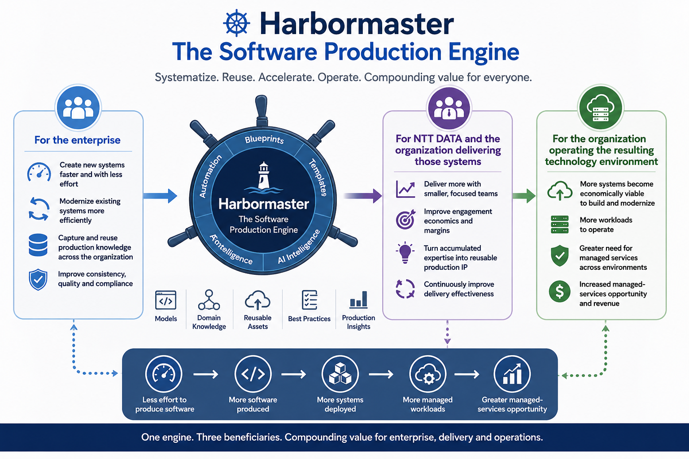

# Why We Built Harbormaster

Harbormaster was built around a simple observation: organizations that create software systems repeatedly are continually recreating much of the knowledge, architecture, engineering effort, and production infrastructure required to build them.

That creates three opportunities.

**For the enterprise**, production knowledge can be captured and reused so that new and modernized systems require progressively less effort to create.

**For NTT DATA and the organization delivering those systems**, accumulated technology, architecture, solution and industry expertise can become executable production capability—allowing focused teams to deliver more with less production effort while improving the economics of each engagement.

**For the organization operating the resulting technology environment**, making software production more efficient can increase the number of systems that are created, modernized and brought into managed operation—expanding the opportunity for cloud, infrastructure and application-management services.

Harbormaster brings these three effects together:

The value does not depend on any one of these outcomes occurring in isolation. **The same production capability can create economic value for the enterprise, for NTT DATA's delivery organization, and for the managed cloud and infrastructure environments in which those systems operate.**

# The Four-Layer NTT DATA Moat

## Layer 1 — Enterprise Software Production

### Make Enterprise Software Easier to Create and Modernize

Harbormaster becomes a production capability that enterprises can use to create new systems and progressively modernize existing ones with less production effort.

NTT DATA already combines consulting, application development, application modernization, application management and industry expertise. Harbormaster can provide a reusable production layer across those capabilities. :contentReference[oaicite:1]{index=1}

**Hypotheses**

- **[H1-01](./layer-1/h1-01.md) — Enterprise system production can be systematized**
- **[H1-02](./layer-1/h1-02.md) — Existing systems can be modernized through executable production knowledge**
- **[H1-03](./layer-1/h1-03.md) — Blueprint coverage can progressively reduce the effort required to create enterprise systems**
- **[H1-04](./layer-1/h1-04.md) — Enterprises can retain and reuse production knowledge beyond individual projects**
- **[H1-05](./layer-1/h1-05.md) — Enterprises can be encouraged to use NTT DATA services and capabilities around systems produced through the platform**

---

## Layer 2 — NTT DATA Production Advantage

### Turn NTT DATA Expertise Into Reusable Production Capability

NTT DATA's accumulated technology, architecture, solution and industry expertise becomes reusable production IP that can improve the economics of successive engagements.

This builds directly on NTT DATA's existing Application Services capabilities, including application development, application and mainframe modernization, application management, product-centric development, architecture and portfolio management, and its industry-specific solutions. :contentReference[oaicite:2]{index=2}

**Hypotheses**

- **[H2-01](./layer-2/h2-01.md) — NTT DATA consulting and application expertise can become executable production IP**
- **[H2-02](./layer-2/h2-02.md) — The same production knowledge can improve the economics of successive engagements**
- **[H2-03](./layer-2/h2-03.md) — Smaller, focused teams can deliver systems that previously required larger delivery teams**
- **[H2-04](./layer-2/h2-04.md) — Lower production costs can improve both client economics and NTT DATA delivery margins**

---

## Layer 3 — Software-to-Managed-Services Conversion

### Convert More Software Production Into More Managed Workloads

The production advantage creates a second-order effect: when software becomes cheaper and faster to create and modernize, more software becomes economically viable to build, modernize and operate.

For NTT DATA, the resulting opportunity extends across its Cloud Platforms, private cloud, public cloud, hybrid cloud, sovereign cloud, infrastructure and application-management capabilities. NTT DATA explicitly offers managed services across public and private cloud platforms and operates a broader cloud and infrastructure portfolio. :contentReference[oaicite:3]{index=3}

**Hypotheses**

- **[H3-01](./layer-3/h3-01.md) — Lower production cost increases the number of economically viable software projects**
- **[H3-02](./layer-3/h3-02.md) — New and modernized systems create additional workloads that require ongoing operation**
- **[H3-03](./layer-3/h3-03.md) — A greater proportion of those workloads can become NTT DATA-managed workloads**
- **[H3-04](./layer-3/h3-04.md) — Increased software production translates into measurable incremental managed-services demand**

---

## Layer 4 — Compounding Software-Production Intelligence

### Make the Entire Production and Managed-Services System Better Over Time

The enterprise systems, delivery experience, blueprints, industry knowledge and production outcomes create a structured body of knowledge that can progressively improve production capability and increasingly be extended by AI.

This complements NTT DATA's existing emphasis on AI-powered application services, its aXet platform, industry solutions, cloud-native building blocks and AI-enabled cloud operations. :contentReference[oaicite:4]{index=4}

**Hypotheses**

- **[H4-01](./layer-4/h4-01.md) — Production outcomes can improve the blueprints used for subsequent systems**
- **[H4-02](./layer-4/h4-02.md) — A growing blueprint continuum increases the range of systems that can be produced**
- **[H4-03](./layer-4/h4-03.md) — AI can increasingly extend and author production knowledge as the structured corpus grows**
- **[H4-04](./layer-4/h4-04.md) — Accumulated production intelligence can simultaneously improve enterprise production, NTT DATA delivery economics and managed-services opportunity**
- **[H4-05](./layer-4/h4-05.md) — ISVs and technology partners can create blueprints that accelerate adoption and usage of their technologies through NTT DATA's delivery ecosystem**